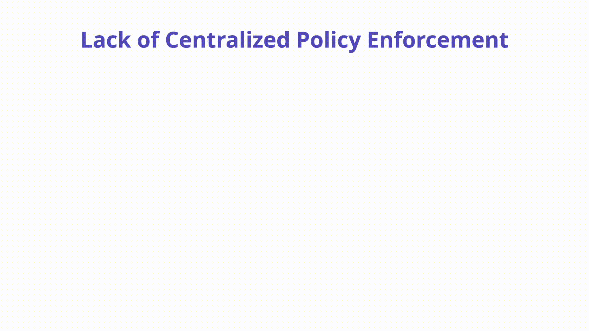

---

layout: col-sidebar
title: "K04: Policy Enforcement"
---

## Overview

Distributing and enforcing security policies across multiple clusters, clouds, and risk tolerances quickly becomes unmanageable for security teams. The inability to detect, remediate, and prevent misconfigurations from a central location can leave clusters open to compromise. 



## Description
Kubernetes policy enforcement can and should take place in a few places throughout the software delivery lifecycle. Policy enforcement gives security and compliance teams the ability to apply governance, compliance, and security requirements throughout a multi-cluster / multi-cloud infrastructure. 


Example Enforcement Policies:

*Disallowing Images from Untrusted Registries:* To prevent rogue images from running in certain clusters, it is recommended to distribute a blocking admission control policy that explicitly allows image registries. An example OPA Gatekeeper Rego policy that would block all workloads using images from registries that don’t match open-policy-agent and ubuntu is below:

```
# Allowed repos
apiVersion: constraints.gatekeeper.sh/v1beta1
kind: K8sAllowedRepos
metadata:
  name: allowed-repos
spec:
  match:
    kinds:
      - apiGroups: [""]
        kinds: ["Pod"]
    namespaces:
      - "sbx"
      - "prd"
  parameters:
    repos:
      - "open-policy-agent"
      - "ubuntu"
```

## How to Prevent

Detecting misconfigured workloads is not enough. Teams need the assurance that misconfigured Kubernetes objects can be blocked upon admission. This is typically handled by an [Admission Controller](https://kubernetes.io/docs/reference/access-authn-authz/admission-controllers/) on the Kubernetes API itself. Built-in functionality exists as part of the Kubernetes API itself called Pod Security Standards to enforce policy as part of the [Pod Security Admission Controller](https://kubernetes.io/docs/concepts/security/pod-security-admission/) in the cluster itself. It offers three modes - Privileged, Baseline, and Restricted. 

Other OSS projects such as Open Policy Agent Gatekeeper, Kyverno, and Kubewarden all offer policy enforcement capabilities as well to prevent misconfigured pods from being scheduled on a cluster. 

### A quick description about tools:
- **OPA Gatekeeper** is a validating admission controller that intercepts requests to the Kubernetes API server and evaluates policies defined in OPA's ```Rego``` language. Gatekeeper is a validating and mutating webhook that enforces CRD-based policies executed by Open Policy Agent. If a policy violation is detected, the admission request is denied. In addition to the admission scenario, Gatekeeper's audit functionality allows administrators to see what resources are currently violating any given policy. It can be used to enforce policies related to pod security, network policies, resource quotas, and other aspects of Kubernetes deployments.

- **Kyverno**, on the other hand, is a Kubernetes-native policy engine that receives validating and mutating admission webhook HTTP callbacks from the kube-apiserver and applies matching policies to return results that enforce admission policies or reject requests. Kyverno policies are defined using ```yaml```, Mutating policies can be written as overlays (similar to [Kustomize](https://kubernetes.io/docs/tasks/manage-kubernetes-objects/kustomization/#bases-and-overlays)) or as a [RFC 6902 JSON Patch](https://jsonpatch.com/). Policy enforcement is captured using Kubernetes events. Kyverno also reports policy violations for existing resources. Kyverno can be used to automate tasks such as setting default labels, enabling encryption, and restricting access to sensitive data.

- **Kubewarden** operates as a Kubernetes admission controller and intercepts requests to the Kubernetes API server. When a request is made, Kubewarden assesses the request against a set of policies defined in ```WebAssembly``` modules. These modules can be written in any language that can compile to WebAssembly, such as Rust, C++, or AssemblyScript.
Kubewarden provides a set of standard policies out-of-the-box, but users can also define their own custom policies. These policies can enforce rules such as restricting access to specific resources, validating inputs, and detecting security vulnerabilities.
Kubewarden also provides an extensible architecture that allows users to integrate with other systems and tools. For example, Kubewarden can be combine with external identity providers, vulnerability scanners, and compliance tools.

**Technical aspects comparison table**

| Tool                      | OPA Gatekeeper | Kyverno | Kubewarden | 
|---------------------------|----------------|-----------|-------------|
| Engine Language                  | GO           | GO | GO	        |
| Admission Controller      | Yes            | Yes       | Yes         |
| Mutating Webhook          | Yes            | Yes       | Yes         |
| Validation Rule Language  | Rego           | YAML/JSON | Any compiled to WebAssembly        |
| Support for Custom Resources | Yes        | Yes       | Yes         | 
| Extensibility             | Highly Extensible | Highly Extensible | Highly Extensible |
| Community                 | Large and Active | Growing   | Small and Active |
| Integration   | Native Integration with Kustomize and Helm | Native Integration with Kustomize and Helm | Native Integration with Open Policy Agent |
| Ease of Installation       | Moderate       | Easy      | Moderate    |


## Example Attack Scenarios
Example #1: Container Breakout 1-Liner

The following command if run against the Kubernetes API will create a very special pod that is running a highly privileged container. First we see `"hostPID": true`, which breaks down the most fundamental isolation of containers, letting us see all processes as if we were on the host. The `nsenter` command switches to a different `mount` namespace where `pid 1` is running which is the host `mount` namespace. Finally, we ensure the workload is `privileged` allowing us to prevent permissions errors. Boom. Container breakout in a [tweet](https://twitter.com/mauilion/status/1129468485480751104)! 

```
 kubectl run r00t --restart=Never -ti --rm --image lol \
	 --overrides '{"spec":{"hostPID": true, 
	 "containers":[{"name":"1","image":"alpine", 
	 "command":["nsenter","--mount=/proc/1/ns/mnt","--","/bin/bash"], 
     "stdin": true,"tty":true,"imagePullPolicy":"IfNotPresent", 
     "securityContext":{"privileged":true}}]}}' \
/
```

## References
- OPA Gatekeeper: [https://github.com/open-policy-agent/gatekeeper](https://github.com/open-policy-agent/gatekeeper)
- Pod Security Admission Controller: [https://kubernetes.io/docs/concepts/security/pod-security-admission/](https://kubernetes.io/docs/concepts/security/pod-security-admission/)
- Kyverno: [https://kyverno.io/](https://kyverno.io/)
- Kubewarden: [kubewarden.io](https://www.kubewarden.io/)
