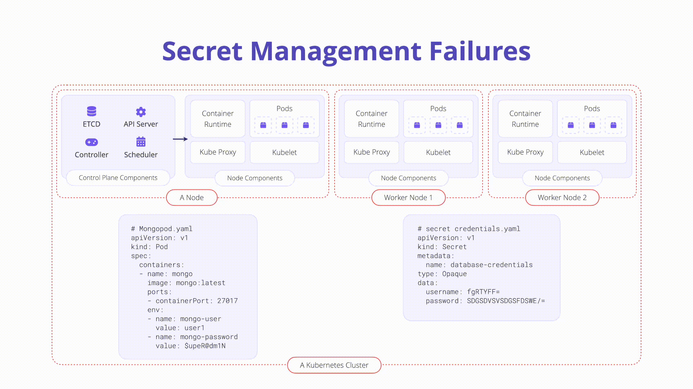

---

layout: col-sidebar
title: "K08: Secrets Management"
---

## Overview

In Kubernetes, a Secret is a small object that contains sensitive data, like a
password or token. It is necessary to assess how sensitive data such as
credentials and keys are stored and accessed. Secrets are a useful features in
the Kubernetes ecosystem but need to be handled with extreme caution.



## Description

Kubernetes secrets are a standalone API object in Kubernetes used to store small
objects. They are created like any other Kubernetes object. Below is a `.yaml`
manifest that creates a secret called `top-secret`:

```yaml
apiVersion: v1
kind: Secret
metadata:
  name: top-secret
data:
  username: bXktdXNlcm5hbWUK
  password: bXktcGFzc3dvcmQK
type: Opaque
```

The `username` and `password` values in the example manifest above are *base64*
encoded and thus not encrypted (by default). This makes checking secrets into
version control or other systems very dangerous. We will explore below how to
prevent secrets leaking to unwanted locations.

## How to Prevent

**Encrypt secrets at
rest[¶](https://cheatsheetseries.owasp.org/cheatsheets/Kubernetes_Security_Cheat_Sheet.html#encrypt-secrets-at-rest)**

The etcd database in general contains any information accessible via the
Kubernetes API and may grant an attacker significant visibility into the state
of your cluster.

Always encrypt your backups using a well reviewed backup and encryption
solution, and consider using full disk encryption where possible.

Kubernetes supports encryption at rest, a feature introduced in 1.7, and v1 beta
since 1.13. This will encrypt Secret resources in etcd, preventing parties that
gain access to your etcd backups from viewing the content of those secrets.
While this feature is currently beta, it offers an additional level of defense
when backups are not encrypted or an attacker gains read access to etcd.

### Address Security Misconfigurations

In order to keep secrets safe and protected, it is important to start with
rock-solid configuration across all of your clusters. Vulnerabilities, image
security, and policy enforcement need to be in place to ultimately protect the
applications from compromise.

RBAC configuration should be locked down as well. Keep all Service Account and
end user access to least privilege - especially when it comes to accessing
secrets. Always audit the RBAC configuration of third-party plugins and software
installed in the cluster to ensure access to Kubernetes secrets is not granted
unnecessarily.

### Ensure Logging and Auditing is in Place

Kubernetes clusters generate useful metrics around activities that can help
detect malicious or anomalous behavior including access to secrets. Make sure to
enable and configure [Kubernetes
Audit](https://kubernetes.io/docs/tasks/debug-application-cluster/audit/)
records and centralize their storage.


## Example Attack Scenarios

An attacker compromises a web application running in a Kubernetes and is able to
get a shell. They run the following command to ensure Kubernetes secrets are
mounted:

```bash
ls /var/run/secrets/kubernetes.io/serviceaccount
```

The attacker installs `kubectl` in the compromised pod which by default will
attempt to use the default service account located in the above directory. The
attacker can then communicate with the Kubernetes API from the inside leveraging
the default service account’s RBAC access. Depending on how that RBAC is
configured, the attacker may be able to read secrets or deploy malicious
workloads into the cluster.

## References

OWASP Kubernetes Cheatsheet:
[https://cheatsheetseries.owasp.org/cheatsheets/Kubernetes_Security_Cheat_Sheet.html#securing-data](https://cheatsheetseries.owasp.org/cheatsheets/Kubernetes_Security_Cheat_Sheet.html#securing-data)
